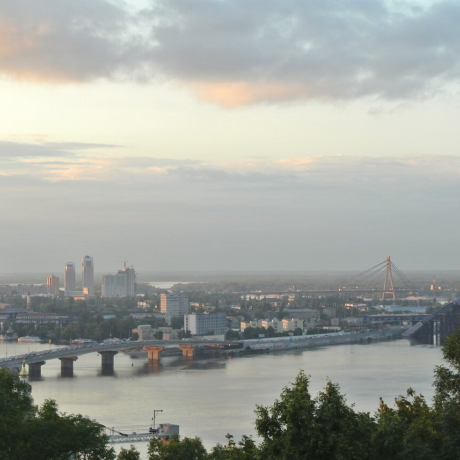

# Project 3: From Homeland to Homeland
### Overview  
An epic journey from Kentucky to Burundi through Wales and Ukraine  
  
**Intro**    
  
This is a project that showcases the hometowns of some of Practicum's employees. We've made it so all the elements are displayed correctly on popular screen sizes. We recommend investing more time in completing this project, since it's more difficult than previous ones.  
  
**Technologies I used:**  
_HTML, _
_CSS Flexbox, _
_CSS Grid Layout, _
_BEM methodology_

**IDE I used:**
_Visual Studio Code_
  
* [Link to the project on GitHub Pages](https://nigberg.github.io/web_project_3/)  
  
**Images**  
  
 
 
 
 
